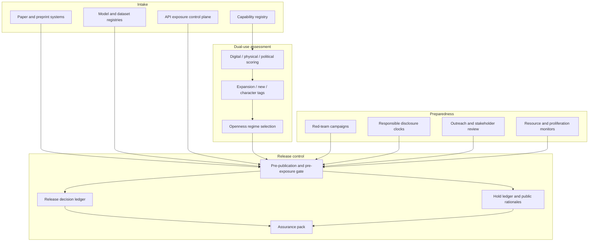

# Dualcast

**Source:** `ai-in-ethics/the_malicious_use_of_ai/`
**Domain:** `ai-ethics`
**One-liner:** A dual-use threat intelligence and misuse-preparedness system that scores AI capability releases across digital, physical, and political security before publication or product exposure, then routes mitigations through red-team findings, disclosure holds, and openness regimes.
**Wedge:** Frontier and applied AI labs (and their safety/security teams) releasing models, datasets, tools, or research artefacts with foreseeable dual-use surface — starting with pre-publication and pre-API-exposure gates for digital-security-relevant capabilities (automated social engineering aids, adversarial ML tooling, vulnerability-finding agents).
**Positioning:** Misuse preparedness as an operational release control, not an ethics dashboard. The landmark malicious-use report forecasts how AI expands, invents, and changes the character of threats; Dualcast turns that taxonomy and its intervention agenda into the workflow that decides *what ships, to whom, under which openness model, and with which documented mitigations*.

## Market research synthesis

### Thesis from source

The February 2018 multi-institution report *The Malicious Use of Artificial Intelligence: Forecasting, Prevention, and Mitigation* (Future of Humanity Institute, CSER, CNAS, EFF, OpenAI and co-authors) argues that AI and machine learning are altering the security landscape for citizens, organisations, and states faster than institutions are adapting. Beneficial applications are real and urgent; the report’s purpose is to forecast, prevent, and mitigate intentional misuse so those benefits are not delayed by unmanaged harm. Scope is deliberately near-term: capabilities already available or plausible within about five years, scenarios in which an actor deploys or compromises AI to undermine another’s security — not mass unemployment, race-to-the-bottom dynamics, or accidental safety failures (the adjacent ai-safety literature).

The report’s structural claim is that growing AI use changes threats in three ways: **expansion of existing threats** (lower cost and higher scale of attacks that once required scarce human labour and expertise), **introduction of new threats** (attacks impractical for humans, plus exploitation of AI systems’ own vulnerabilities), and **change to the typical character of threats** (more effective, finely targeted, harder to attribute, and likely to exploit ai-system weaknesses). It analyses this across three security domains. **Digital security:** AI automates labour-intensive cyberattacks such as spear phishing, enables speech-synthesis impersonation, automated hacking, and attacks on AI via adversarial examples and data poisoning — alleviating the historical trade-off between scale and efficacy. **Physical security:** autonomy in drones and other systems expands threats from weaponised consumer platforms, subversion of cyber-physical systems (e.g. causing autonomous vehicles to crash), and attacks infeasible to direct remotely (e.g. micro-drone swarms). **Political security:** ai-enabled surveillance, targeted propaganda, and deceptive media expand privacy invasion and social manipulation — most acute under authoritarian regimes, but also threatening democracies’ capacity for truthful public debate.

Four high-level recommendations define the institutional response Dualcast operationalises: (1) policymakers collaborate closely with technical researchers without impeding research unless benefits are commensurate; (2) researchers and engineers treat dual-use seriously, letting misuse considerations shape priorities and norms and reaching out when harm is foreseeable; (3) import mature dual-use practices from computer security (notably red teaming) into AI; (4) expand the stakeholder set beyond the usual ai-policy circle. Four priority research areas supply the product’s capability map: learn from cybersecurity (red teaming, formal verification where applicable, responsible disclosure of AI vulnerabilities, security tools, secure hardware, capability forecasting); explore openness models (pre-publication risk assessment, central-access licensing, selective sharing regimes that favour safety, lessons from other dual-use fields); promote a culture of responsibility (education, ethical standards, whistleblowing, nuanced dual-use narratives); and develop tech/policy solutions (privacy protection, coordinated public-good security uses of AI, monitoring of ai-relevant resources, legislative responses). The commercially defensible object is not a generic “AI ethics platform” but a release-and-sharing control plane that scores capabilities against the three-domain taxonomy, runs red-team campaigns, manages disclosure clocks, and records which openness regime applies — with an auditable trail for boards, funders, and eventually regulators.

### Buyer & economic model

- **Primary buyer:** Head of AI Security / Trust & Safety / Responsible AI at a lab or platform company with public model or API releases; co-sponsored by General Counsel and the research leadership who own publication norms.
- **Users:** capability owners and research leads (pre-release assessments), red-team and security researchers (campaigns and vulnerability intake), publication and product release managers (gates and holds), policy and government-affairs staff (stakeholder outreach packs), compliance and audit (evidence of dual-use process), and external trusted partners under selective-sharing regimes.
- **Budget owner / value metric:** the research and product risk budget. Value metric is releases that clear a documented dual-use gate without post-hoc crisis — measured as time-to-mitigated-release, share of high-risk artefacts under delayed or restricted openness, red-team findings closed before exposure, and disclosure incidents handled within defined clocks.
- **Competing status quo:** ad-hoc ethics review meetings, publication checklists that ignore domain-specific misuse vectors, security bug bounties that do not cover model/adversarial exploits, and public default-to-open research norms with no pre-publication risk assessment — exactly the openness downside the report flags when digital-security and adversarial-ML results amplify attackers.

### Domain constraints

- **Regulatory / trust / safety:** dual-use decisions sit at the boundary of academic norms, national security interest, and civil liberties; Dualcast must not become a pretext for competitive secrecy (the report warns against that abuse). Responsible disclosure must protect defenders without creating permanent black boxes. Political-security assessments touch speech and surveillance legitimacy — human judgment and multi-stakeholder review are mandatory for high scores in that domain.
- **Data sensitivity:** red-team artefacts, unpublished exploits, and selective-sharing packages are highly sensitive; access must be compartmented. Assessment dossiers may reference unpublished research and partner identities under NDA.
- **Change-management realities:** researchers resist gates that feel like censorship; the product must default to transparent rationales, time-boxed holds, and reversible openness decisions. Labs will not replace their paper pipeline overnight — Dualcast must plug into existing preprint, conference, and API-release workflows as a gate, not a parallel bureaucracy.

## Business requirements

- BR-1: Every capability artefact proposed for publication, model download, or API exposure must receive a dual-use assessment scored separately against digital, physical, and political security domains before release.
- BR-2: Assessments must classify how the capability expands existing threats, introduces new threats, or changes attack character, using the report’s three landscape-change categories as first-class fields — not free-text only.
- BR-3: No high-risk artefact may ship under full public openness without a recorded openness regime decision (full open, delayed disclosure, central-access licensing, or selective trusted sharing) and a named approver.
- BR-4: Red-team campaigns must be runnable against capability artefacts and production AI systems, with findings tracked to remediation or accepted residual risk before the release gate can clear.
- BR-5: ai-specific vulnerability reports (security flaws, adversarial inputs, data-poisoning pathways, misuse recipes) must follow a responsible-disclosure clock with confidential intake, vendor/lab notification, and public timeline controls analogous to software CVE practice.
- BR-6: Pre-publication risk assessment must be mandatory for technical areas of special concern (at minimum digital-security tooling and adversarial machine learning) with documented criteria for when assessment is required versus optional.
- BR-7: When harmful applications are foreseeable, the system must support proactive outreach to relevant external actors (security vendors, policymakers, affected platform operators) and record that outreach as part of the release dossier.
- BR-8: Stakeholder expansion must be operational: assessments above a threshold require review roles beyond the originating lab (e.g. external security expert, civil-society or domain expert for political-security cases), not only internal researchers.
- BR-9: Openness decisions must publish a public rationale when openness is reduced, so competitive secrecy cannot hide behind misuse claims without challenge.
- BR-10: Culture-of-responsibility artefacts — training completion, ethical-statement acknowledgements, and whistleblowing intake — must be linkable to teams shipping dual-use-relevant work.
- BR-11: Monitoring of ai-relevant resources (compute allocations, model checkpoints, dataset releases, API rate anomalies consistent with capability exfiltration or large-scale misuse) must feed alerts into preparedness playbooks.
- BR-12: Every cleared or blocked release must produce an auditable pack suitable for board, funder, or regulator review: taxonomy scores, red-team status, openness regime, disclosure holds, and residual-risk acceptance.

## User stories

Canonical user stories live in sibling [USER_STORIES.md](USER_STORIES.md).

## System design

### Overview

Dualcast sits in front of publication, checkpoint release, and API exposure. A **capability artefact** enters with metadata (modality, access surface, claimed beneficial uses). An **assessment** scores digital, physical, and political security, records landscape-change categories, and proposes an **openness regime**. **Red-team campaigns** and **vulnerability disclosures** attach evidence. If scores breach thresholds, **outreach tasks** and **stakeholder reviews** are required. **Resource monitors** watch for anomalous access to models, data, and compute. Cleared releases write an immutable **release decision**; blocked or delayed items stay on a **hold ledger** with public rationale when openness is reduced. The system is the operationalisation of the report’s recommendations and four priority research areas — not a chatbot ethics survey.

### Actors & boundaries

- **Actors:** research leads, red-teamers, release managers, policy staff, external stakeholder reviewers, compliance/audit, whistleblowers, lab operators, and (indirectly) defenders who receive coordinated disclosure.
- **Trust boundary:** Dualcast is authoritative for assessments, gates, disclosure clocks, and openness decisions; source control, model registries, and paper systems remain systems of record for the artefacts themselves. Highly sensitive exploit details stay in a restricted compartment; public rationales never include exploit recipes.
- **Human-in-the-loop points:** high-risk political-security scoring, residual-risk acceptance, openness reductions, disclosure clock extensions, whistleblowing adjudication, and any override of an automated resource alert.

### Core capabilities

1. **Capability registry** — artefacts, versions, access surfaces (paper, weights, API, dataset).
2. **Three-domain dual-use assessment** — digital / physical / political scores plus expansion / new / character-change tags.
3. **Openness regime management** — full open, delayed disclosure, central-access licensing, selective trusted sharing, with public rationales for reductions.
4. **Pre-publication and pre-exposure gates** — mandatory assessment for special-concern areas; block/clear/hold outcomes.
5. **Red teaming** — campaign planning, findings, remediation linkage to gates.
6. **Responsible AI vulnerability disclosure** — confidential intake, clocks, coordinated publish.
7. **Outreach and stakeholder review** — Recommendation #2/#4 workflows.
8. **Resource and proliferation monitoring** — compute, checkpoint, dataset, and API anomaly signals into playbooks.
9. **Culture-of-responsibility records** — training, standards acknowledgement, whistleblowing.
10. **Assurance and audit export** — release packs for board/funder/regulator.

### Conceptual data

- **Primary entities:** CapabilityArtefact, DualUseAssessment, DomainScore, LandscapeChangeTag, OpennessRegime, ReleaseGate, RedTeamCampaign, Finding, VulnerabilityDisclosure, DisclosureClock, OutreachTask, StakeholderReview, ResourceAlert, HoldRecord, ReleaseDecision, AssurancePack, WhistleblowingCase, TrainingRecord.
- **Critical events:** artefact registered; assessment submitted; domain threshold breached; openness regime selected; gate blocked/cleared/held; red-team finding opened/closed; disclosure clock started/expired; outreach completed; stakeholder review signed; resource alert raised; whistleblowing case opened; assurance pack generated.
- **Retention / audit needs:** assessments, gates, openness rationales, and residual-risk acceptances retained for the full institutional and potential regulatory window with immutable history; exploit payloads and selective-sharing contents retained under strict compartmentation with shorter operational retention after remediation; public rationales retained indefinitely as transparency artefacts.

### Integrations (conceptual)

- **Systems of record:** model registry, dataset catalogue, paper/preprint submission systems, API gateway / model-serving control plane, ticketing for security incidents.
- **Upstream signals:** capability evaluation harnesses, threat-intel feeds on ai-enabled attack techniques, compute cluster usage, download and API telemetry, conference/programme deadlines.
- **Downstream actions:** hold or clear publication, revoke or scope API keys, trigger delayed disclosure timers, notify trusted partner lists, open security tickets, emit board assurance packs.

### High-level architecture

Assessment and red teaming are deliberative; the gate is the hard control on exposure. Monitoring runs continuously and can reopen a gate after release if proliferation signals warrant.

### Success metrics

- **Leading:** share of special-concern artefacts with completed three-domain assessments before exposure; median days from red-team finding to remediation or accepted risk; disclosure clocks met without premature public dump; share of high-risk releases under non-full-open regimes with published rationales; stakeholder reviews completed when political-security thresholds trip.
- **Lagging:** post-release misuse incidents attributable to ungated artefacts (target: zero for gated cohorts); time from foreseeability flag to external outreach; board/funder audit findings on dual-use process; researcher adoption rate (assessments filed without enforcement escalation); false-positive hold rate that is reviewed down without silent bypasses.

## OpenAPI skeleton

Canonical HTTP surface lives in sibling [openapi.yaml](openapi.yaml). Summary:

- **Base path:** `/v1/...`
- **Auth:** `X-API-Key` for model registry, API gateway, and monitoring integrations; Bearer JWT for researchers, red-teamers, release managers, and compliance in the console.
- **Resource groups:** Capabilities, Assessments, Openness, Gates, RedTeams, Disclosures, Outreach, Monitoring, Assurance.
