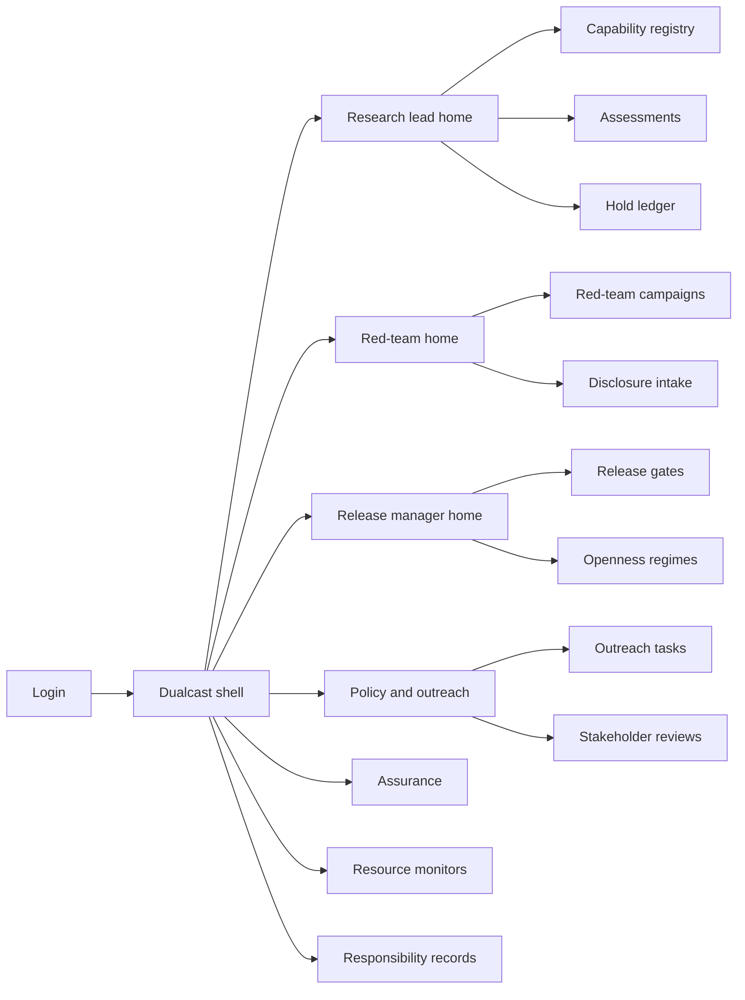
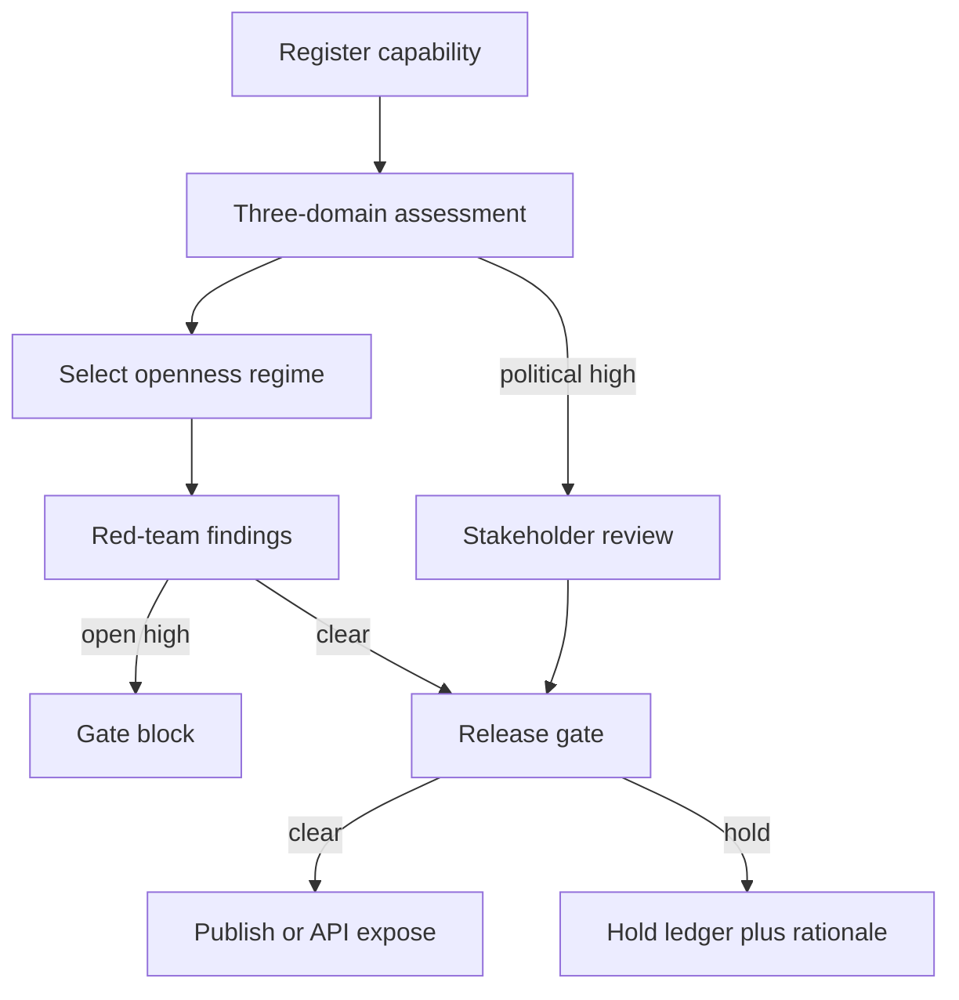

# Dualcast — Web app

**Product:** [PRODUCT.md](./PRODUCT.md)
**Primary surface:** Dual-use release control console (research leads, red-teamers, release managers, policy, compliance)
**Secondary surfaces:** Confidential vulnerability intake (compartmented); public openness-rationale page (read-only when openness reduced); selective-sharing partner portal (trusted recipients only)
**Design thesis:** Dualcast is a dual-use air-traffic control tower for capability exposure — not an ethics survey, not a board harm radar, and not a delivery-stage gate. The metaphor is a three-band threat scope (digital / physical / political) over a dark ops floor: each artefact lights the bands it energises, and the release gate shows which openness regime applies — full open, delayed, central-access, or selective share — with a public rationale when the aperture narrows. Visual language is charcoal ops with phosphor green for cleared exposure, caution amber for disclosure clocks and holds, and signal red for ungated high-risk. The spirit of the malicious-use report — expansion, invention, and character-change of threats — is encoded as mandatory classification fields, not as decorative copy.

## UX research synthesis

### Category peers (best-in-class)

- **HackerOne / Bugcrowd disclosure workflows:** Confidential intake, timed disclosure clocks, coordinated publish, severity triage. Steal: clock UX and compartmented exploit detail; reject bounty gamification aesthetics for lab dual-use.
- **MITRE ATT&CK Navigator:** Multi-domain threat matrices that force structured coverage rather than narrative risk. Steal: digital/physical/political as first-class scored bands plus landscape-change tags; reject pretending ATT&CK enterprise TTPs alone cover political-security manipulation.
- **Hugging Face gated models / Meta Llama license portals:** Access regimes between full open and private — applications, approved users, revoked access. Steal: central-access vs selective sharing as operational controls wired to the gate; reject license legalese as the only UI.
- **Microsoft PyRIT / Azure AI Red Teaming report surfaces:** Campaign findings attached to model releases as blockers. Steal: findings as release-gate evidence with remediation linkage; reject burying red team in a disconnected security wiki.

### Patterns to adopt / reject

- **Adopt:** Capability artefact as primary object (paper / weights / API / dataset / tool); three-domain scores + expansion/new/character tags; openness regime with public rationale on reduction; red-team findings as hard gate inputs; disclosure clocks; stakeholder review when political-security thresholds trip; resource/proliferation alerts that can reopen gates; assurance packs for board/funders.
- **Reject:** Generic ethics scorecards; Greylight proceed/barred sprint chrome; Attestra Art. 22 clearance seals; Bellwether sacrifice ledgers; indefinite “ethics hold” without reopen date; purple responsible-AI glow; competitive secrecy without published rationale (BR-9).

### Trust, density, and workflow constraints from PRODUCT.md

Researchers resist censorship-feeling gates — time-boxed holds and transparent rationales are mandatory (change-management). Exploit recipes never appear in public rationales (trust boundary). Political-security highs require human + expanded stakeholder review (BR-8). Monitoring can reopen a gate after release (architecture). Dualcast must plug into preprint/API workflows as a gate, not a parallel bureaucracy.

## Information architecture

### Nav model

### Roles → default home

| Role | Default home | Why |
|------|--------------|-----|
| Research / capability lead | Owner home — artefacts nearing exposure | Pre-release design input (stories) |
| Red-team / AI security | Campaigns + disclosure intake | Findings as blockers (BR-4, BR-5) |
| Release / publication manager | Gates queue | Block until openness + red-team clear (BR-3) |
| Policy / gov affairs | Outreach and stakeholder reviews | Recs #2/#4 operationalised (BR-7, BR-8) |
| Compliance / board reader | Assurance packs | Auditable cohort evidence (BR-12) |
| Whistleblower / intake | Confidential culture channel | Exception path (BR-10) |
| Trusted partner | Selective-sharing portal | Regime-scoped access only |

### Cross-links to OpenAPI resources

| Nav area | OpenAPI tags / resources |
|----------|---------------------------|
| Capability registry | Capabilities |
| Three-domain scoring | Assessments |
| Regimes and rationales | Openness |
| Pre-pub / pre-API gates | Gates |
| Campaigns and findings | RedTeams |
| Vulnerability clocks | Disclosures |
| External reach-out | Outreach |
| Proliferation alerts | Monitoring |
| Board/funder packs | Assurance |

## Screen inventory

### Research lead home

- **Purpose:** Answer “what am I about to expose, which threat bands light up, and what’s blocking the gate?”
- **Entry:** Default for capability owners.
- **Layout regions:** Upcoming exposures (paper deadline, API ship); domain band summary; open findings; hold reopen dates; special-concern mandatory-assessment cue.
- **Primary actions:** Register artefact; start assessment; request delayed disclosure with reopen date.
- **Empty / loading / error:** Empty = connect model registry / preprint system; error = retry with request id.
- **BR / story ties:** BR-1, BR-6; research lead stories.

### Capability registry

- **Purpose:** Authoritative list of artefacts by access surface (paper, weights, API, dataset, tool) and version.
- **Entry:** Capabilities nav; registry sync.
- **Layout regions:** Filterable table; access-surface badges; linked assessment/gate status; beneficial-use claims (secondary, never replacing taxonomy).
- **Primary actions:** Register; version; link systems of record.
- **Empty / loading / error:** Missing surface metadata blocks assessment submit.
- **BR / story ties:** BR-1; capability registry capability.

### Dual-use assessment

- **Purpose:** Score digital / physical / political separately; force expansion / new-threat / character-change tags.
- **Entry:** From artefact; Assessments nav.
- **Layout regions:** Three band scorers; landscape-change required fields; special-concern criteria panel; foreseeability flag that spawns outreach; residual notes.
- **Primary actions:** Submit assessment; escalate threshold breach; assign stakeholder review when political high.
- **Empty / loading / error:** Generic “benefits outweigh risks” without tags = validation fail.
- **BR / story ties:** BR-1, BR-2, BR-6, BR-8.

### Openness regime selector

- **Purpose:** Choose full open / delayed / central-access / selective sharing with named approver; publish rationale when reduced.
- **Entry:** Gate workflow; Openness nav.
- **Layout regions:** Regime cards as interaction containers; technical control mapping (API scope, partner list, timer); public rationale editor (no exploit recipes); challenge link for transparency.
- **Primary actions:** Select regime; publish rationale; set reopen date for delayed.
- **Empty / loading / error:** High-risk + full open without approver = hard block (BR-3).
- **BR / story ties:** BR-3, BR-9.

### Release gate board

- **Purpose:** Hard control on publication, download, and API exposure — clear / hold / block.
- **Entry:** Release manager default.
- **Layout regions:** Gate queue by deadline; checklist (assessment, openness, red-team, outreach, stakeholder); decision ledger; reopen-from-monitor cue.
- **Primary actions:** Clear; hold; block; override with residual-risk acceptance (named).
- **Empty / loading / error:** Bypass attempt from API control plane = coral alert with runbook.
- **BR / story ties:** BR-3, BR-4, BR-12.

### Red-team campaigns

- **Purpose:** Plan and run campaigns against candidate artefacts/systems; findings tagged by domain and linked to gate.
- **Entry:** Red-team home.
- **Layout regions:** Campaign list; scope; finding board (open/remediated/accepted risk); domain tags; attachment to gate status.
- **Primary actions:** Open finding; remediate; accept residual risk; block gate on open high severity.
- **Empty / loading / error:** Required campaign incomplete = gate cannot clear.
- **BR / story ties:** BR-4.

### Responsible disclosure desk

- **Purpose:** Confidential AI vulnerability intake with clocks, lab notification, coordinated publish.
- **Entry:** Disclosures nav; external reporter link.
- **Layout regions:** Intake form; severity; clock meter; compartmented exploit pane; public timeline controls; CVE-analog status.
- **Primary actions:** Open case; notify; extend clock (justified); publish coordinated.
- **Empty / loading / error:** Clock expiry without publish decision = amber escalation; premature dump prevention.
- **BR / story ties:** BR-5.

### Outreach and stakeholder review

- **Purpose:** Track proactive external outreach and expanded-circle reviews when thresholds trip.
- **Entry:** Policy home; assessment foreseeability flag.
- **Layout regions:** Outreach task list; stakeholder assignee (external security / civil society for political); sign-off; dossier link without exploit dump.
- **Primary actions:** Create outreach; assign reviewer; record completion.
- **Empty / loading / error:** Threshold tripped without tasks = gate block.
- **BR / story ties:** BR-7, BR-8.

### Hold ledger and public rationales

- **Purpose:** Inventory delayed and selective-sharing items with reopen dates and challengeable public rationales.
- **Entry:** Holds from owner home; board visibility.
- **Layout regions:** Hold table; reopen countdown; public rationale preview; inventory for board (BR board story).
- **Primary actions:** Reopen; extend with justification; publish rationale update.
- **Empty / loading / error:** Indefinite hold without date forbidden.
- **BR / story ties:** BR-3, BR-9; board story on selective inventory.

### Resource and proliferation monitoring

- **Purpose:** Alerts on compute, checkpoints, datasets, API anomalies consistent with exfiltration or large-scale misuse; feed playbooks / reopen gates.
- **Entry:** Monitoring nav.
- **Layout regions:** Alert stream; playbook status; linked artefacts; reopen gate action.
- **Primary actions:** Acknowledge; open playbook; reopen gate; dismiss with reason.
- **Empty / loading / error:** Empty = healthy with last sensor check; silent dismiss of high alerts audited.
- **BR / story ties:** BR-11.

### Culture-of-responsibility records

- **Purpose:** Training, ethical-statement acknowledgements, whistleblowing intake linkable to shipping teams.
- **Entry:** Culture nav; compliance.
- **Layout regions:** Team coverage matrix; acknowledgement status; confidential whistleblowing entry; case outcomes (role-scoped).
- **Primary actions:** Record training; open whistleblowing; link team to dual-use work.
- **Empty / loading / error:** Shipping team without coverage = amber on gate for special-concern.
- **BR / story ties:** BR-10.

### Assurance pack builder

- **Purpose:** Auditable export: taxonomy scores, red-team status, openness regime, disclosure holds, residual risk.
- **Entry:** Compliance default; cohort select.
- **Layout regions:** Cohort picker; pack contents checklist; export history; redaction of exploit compartments.
- **Primary actions:** Generate pack; share with board/funder; attest completeness.
- **Empty / loading / error:** Incomplete gate evidence = cannot generate “cleared” pack.
- **BR / story ties:** BR-12.

## Key flows

1. **Pre-exposure clear** — register artefact → three-domain assessment + landscape tags → openness regime → red-team findings closed → outreach/stakeholder if needed → gate clear; failure: open findings or high-risk full-open without approver.

2. **Delayed disclosure** — choose delayed regime → set reopen date → public rationale → timer → reopen assessment → clear or extend with justification.

3. **Responsible disclosure clock** — confidential intake → notify lab → remediate → coordinated publish before clock expiry; extend only with recorded reason.

4. **Post-release proliferation alert** — monitor fires → playbook → reopen gate → revoke/scope API or pull weights access → assurance note.

5. **Whistleblowing on misuse concern** — confidential intake → independent route → adjudicate → link to artefact/gate without retaliatory line visibility.

## Design system

### Tokens (CSS variables)

- `--color-ink: #E6EDE8` — primary text
- `--color-ops-950: #0A0D0C` — app ground
- `--color-ops-900: #121816` — panels
- `--color-ops-700: #24302A` — scope rings
- `--color-phosphor: #3DDC97` — cleared exposure / gate clear
- `--color-phosphor-dim: #1F6B4A` — phosphor on dark
- `--color-caution: #E6A23C` — disclosure clocks / holds
- `--color-signal: #E85D4C` — ungated high-risk / block
- `--color-band-digital: #4A9BB8` — digital security band
- `--color-band-physical: #8B7BB8` — physical security band (muted slate-violet, not purple-glow marketing)
- `--color-band-political: #C4A35A` — political security band
- `--color-steel: #8A9A92` — secondary labels
- `--font-display: "Space Grotesk", sans-serif` — gate titles and band scores
- `--font-body: "IBM Plex Sans", sans-serif` — dense ops UI
- `--font-mono: "IBM Plex Mono", monospace` — artefact ids, clocks, hashes
- `--space-1`…`--space-8`: 4px scale
- `--radius-sm: 3px`; `--radius-md: 6px` — ops-sharp
- `--motion-gate: 180ms ease-out` — clear/block flash
- `--motion-clock: 280ms ease-in-out` — disclosure countdown pulse
- `--motion-band: 320ms ease-in-out` — threat-band illuminate
- Atmosphere: darkened control room with faint CRT scanlines on the three-band scope only; no stock “hacker hoodie” photography; public rationale pages use high-contrast daylight paper distinct from ops floor.

### Typography & brand

- Space Grotesk for gate and band numerals; Plex for tables and dossiers.
- Brand “Dualcast” as chrome mark on every gate-bearing view; login: brand-first, one headline (“What ships, to whom, under which openness”), one CTA — no KPI tile strip.

### Do / don’t

- **Do:** Force landscape-change tags; show three bands separately; time-box holds; publish rationales without recipes; attach red-team to gates; allow post-release reopen.
- **Don’t:** Ethics score heroes; indefinite censorship holds; purple AI glow; exploit recipes in public UI; card grids for static policy; emoji “safe to ship.”

### Accessibility & domain trust cues

- Band colours always paired with text labels; AA+ on phosphor/caution/signal against ops.
- Live regions for clock expiry, gate reopen, high-severity findings.
- Compartmented panes announce restricted access; focus never traps exploit content in general search.
- Focus order: artefact → assessment → openness → red-team → gate.

## Component patterns

- **ThreatBandScope** — digital / physical / political scores on one artefact.
- **LandscapeChangeTags** — expansion / new / character-change required chips.
- **OpennessRegimePicker** — four regimes with control mapping.
- **PublicRationaleCard** — challengeable reduction rationale (no recipes).
- **DisclosureClockMeter** — confidential case countdown.
- **RedTeamFindingRow** — domain-tagged finding linked to gate.
- **GateChecklist** — assessment / openness / red-team / outreach / stakeholder.
- **HoldReopenTimer** — delayed-disclosure reopen date.
- **ProliferationAlert** — resource anomaly with playbook/reopen.
- **AssurancePackExport** — board/funder cohort evidence.

## Out of scope for v1 web

- Training/fine-tuning IDEs; general SOC SIEM replacement; consumer deepfake detectors; national export-control filing systems; native mobile; replacing preprint servers or model registries as systems of record (gate integration only).
